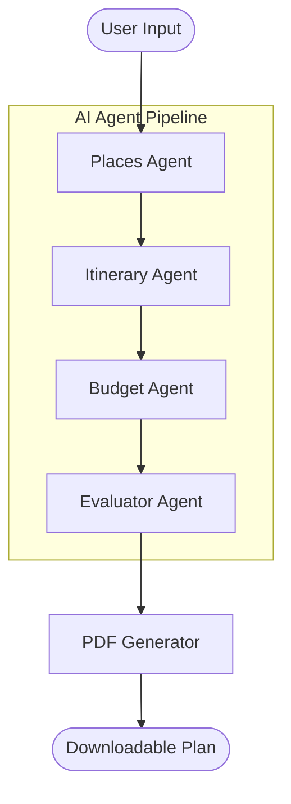

# 🌍 IntelliTrip AI: Multi-Agent Travel Planner


IntelliTrip AI is a production-grade **Multi-Agent Travel Planning System** orchestrated with **LangGraph**. It automates the complex process of researching, planning, budgeting, and evaluating travel itineraries through a specialized pipeline of AI agents.

---

## 🚀 Live Demo
Experience the autonomous planner here:
**[https://multi-agent-ai-travel-planner-jqjwzedlmn84eegchewjbm.streamlit.app/](https://multi-agent-ai-travel-planner-jqjwzedlmn84eegchewjbm.streamlit.app/)**

---

## 🧠 Autonomous Architecture
This system utilizes a directed acyclic graph (DAG) to manage state and control flow between specialized AI agents:



### The Agent Squad:
*   **📍 Places Agent:** Uses **DuckDuckGo Search** to find trending and relevant attractions for specific destinations and interests.
*   **🗺️ Itinerary Agent:** Powered by **Llama 3.3 (Groq)**, it synthesizes search results into a detailed, day-wise structured travel plan.
*   **💰 Budget Agent:** Provides category-wise cost estimations (Travel, Stay, Food, Activities) in **INR**.
*   **🧠 Evaluator Agent:** Critiques the plan based on practicality, coverage, and quality, providing an automated **AI Quality Score**.

---

## ✨ Key Features
- **Smart Discovery:** Real-world search-augmented attraction finding.
- **Dynamic Orchestration:** LangGraph-managed state for consistent agent handoffs.
- **Budget Intelligence:** Realistic cost breakdowns tailored to your travel style.
- **Self-Critique:** Automated evaluation loop to ensure plan feasibility.
- **PDF Export:** Professional A4-formatted travel guides ready for your trip.
- **Cinematic UI:** A sleek, high-performance Streamlit interface with live metrics and progress indicators.

---

## 🛠️ Tech Stack
- **Core:** Python 3.9+
- **Agent Framework:** LangGraph & LangChain
- **LLM Engine:** Groq (Llama-3.3-70b-versatile)
- **Search Tool:** DuckDuckGo Search API
- **UI:** Streamlit
- **PDF Engine:** ReportLab

---

## 📂 Project Structure
```text
Multi-Agent-AI-Travel-Planner/
├── agents/             # Logic for specialized AI agents
│   ├── places_agent.py
│   ├── itinerary_agent.py
│   ├── budget_agent.py
│   └── evaluator_agent.py
├── prompts/            # Structured system instructions
│   ├── itinerary_prompt.txt
│   └── budget_prompt.txt
├── graph.py            # LangGraph workflow orchestration
├── app.py              # Streamlit application & PDF logic
├── requirements.txt    # Project dependencies
└── README.md
```

---

## ⚙️ Installation & Setup

1. **Clone the repository:**
   ```bash
   git clone https://github.com/disha-das756/Multi-Agent-AI-Travel-Planner.git
   cd Multi-Agent-AI-Travel-Planner
   ```

2. **Set up a virtual environment:**
   ```bash
   python -m venv venv
   source venv/bin/activate  # On Windows: venv\Scripts\activate
   ```

3. **Install dependencies:**
   ```bash
   pip install -r requirements.txt
   ```

4. **Add your API Keys:**
   Create a `.env` file in the root directory:
   ```env
   GROQ_API_KEY=your_groq_api_key_here
   ```

5. **Launch the app:**
   ```bash
   streamlit run app.py
   ```

---

## 👨‍💻 Author
**Disha Das**  
*AI & Multi-Agent Systems Developer*

---
© 2026 IntelliTrip AI – Automating the Future of Travel.
